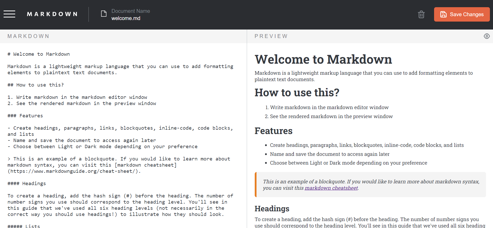
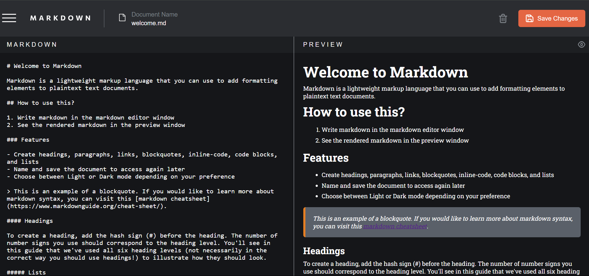

# markdown-editor

# In-Browser Markdown Editor

## Description
An intuitive and user-friendly in-browser markdown editor that allows users to write and preview markdown in real-time. Designed to enhance productivity and streamline the writing process.

## Table of Contents
- [Demo](#demo)
- [Installation](#installation)
- [Features](#features)
- [Development](#development)
- [Technologies Used](#technologies-used)
- [Contact](#contact)

## Demo
Check out the live Site [here](https://markdowntest.netlify.app/).


### Light Mode


### Dark Mode


## Installation

### Prerequisites
- Node.js >= v14.x
- npm >= v6.x

### Steps
1. Clone the repository:
    ```bash
    git clone https://github.com/AkideweKuseh/markdown-editor.git
    ```
2. Navigate to the project directory:
    ```bash
    cd markdown-editor
    ```
3. Install dependencies:
    ```bash
    npm install
    ```
4. Run the project:
    ```bash
    npm run dev
    ```

### Supported Markdown Syntax
- Headers
- Lists
- Links
- Images
- Code blocks
- Tables
- blockquotes and more.

## Features
- Real-time markdown preview
- Dark mode support
- User is able to CREAT, READ, UPDATE and DELETE Documents
- The App is Desktop, Tablet and Mobile responsive.

## Development
### Project Structure
- `src/` - Source files
- `public/` - Public assets

## Technologies Used
- Vue.js
- TypeScript
- Marked Library
- HTML/CSS
- vite

## Contact
For any questions or suggestions, please contact [ce-makuseh1720@st.umat.gh](mailto:ce-makuseh1720@st.umat.gh).

